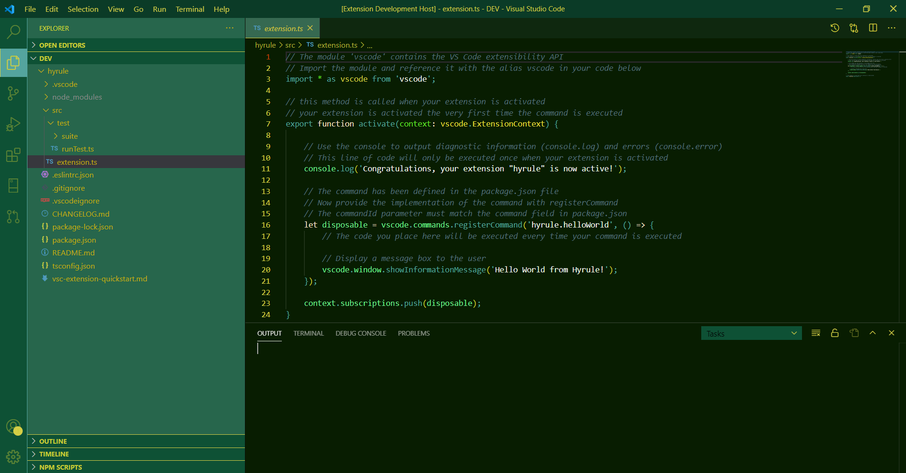
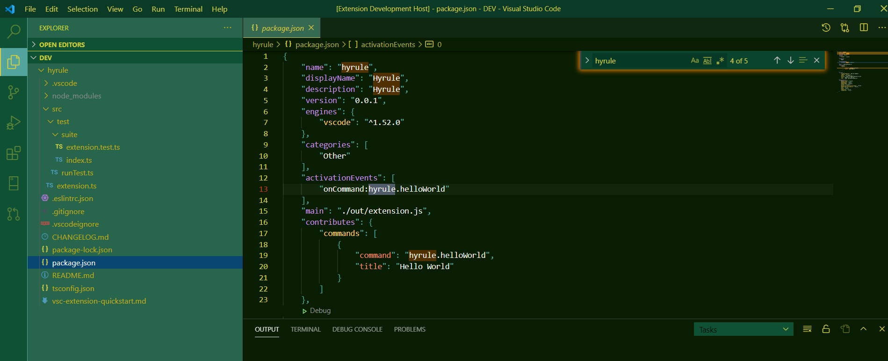

# Legend of Zelda Theme

## Description

This is a theme for VS Code inspired by the Legend of Zelda.

## Installation

1. Open VSCode Extensions sidebar panel
2. Search Zelda
3. Install

## Inspo

Color Theme inspired from 
[here](https://www.color-hex.com/color-palette/4125)
[here](https://www.color-hex.com/color-palette/9142)
[and here](https://colorswall.com/palette/18682/)
